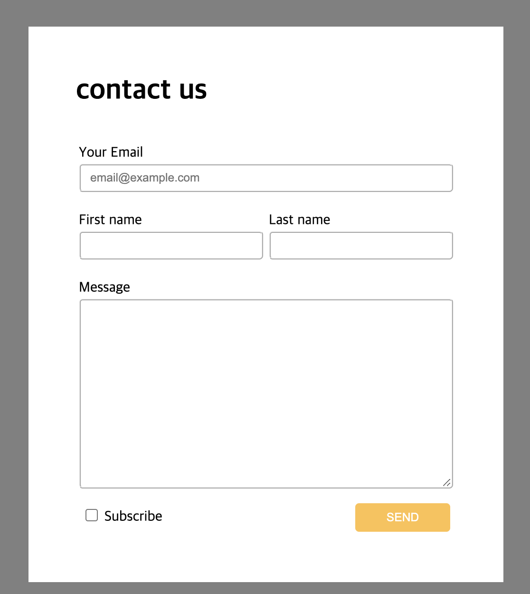

<h1>HTML/CSS 스터디</h1>

HTML/CSS All-in-one : 기초부터 Bootstrap, SASS, 고급 animation 까지 | 코딩애플

<h3>목차</h3>
<ul>
  <li>기초모듈</li>
    <ol>
      <li>HTML 기초와 개발환경 셋팅</li>
      <li>HTML 기본 태그로 글 작성해보기</li>
      <li>기본적인 웹페이지 스타일링</li>
      <li>CSS 파일 만들고 첨부하는 법</li>
      <li>웹레이아웃의 기초 : div를 이용한 네모네모 박스 디자인</li>
      <li>레이아웃 만들기 1 : 호환성 좋은 float</li>
      <li>레이아웃 만들기 2 : 귀찮은 inline-block</li>
      <li>레이아웃 만들기 숙제 : Blog 글목록 만들기 - 230513 
        
      </li>
      <li>셀렉터를 이용해 CSS 코드 양 줄이기</li>
      <li>배경 이쁘게 넣는 스킬들 & margin collapse</li>
      <li>position과 좌표 레이아웃 만들기</li>
      <li>position 숙제 & 반응형 width & box-sizing</li>
      <li>form & input</li>
      <li>form & input 숙제 : Contact Us 섹션 만들기 - 230514 
        
      </li>
      <li>쓸데 많은 Table 레이아웃과 vertical-align속성</li>
      <li>Table 레이아웃 숙제 : Cart 페이지 만들기</li>
      <li>pseudo-class로 인터랙티브 버튼 만들기</li>
      <li>코드양이 줄어드는 class 작명법 (OOCSS, BEM)</li>
    </ol>
  <li>중급모듈</li>
  <li>고급모듈</li>
</ul>